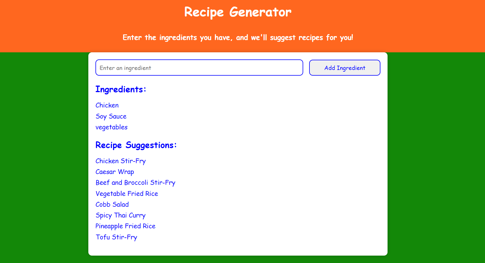

# Recipe Suggester - Developer's Write-up
In this write-up, I'll provide a detailed explanation of how we incorporated classes, switch statements, and try-catch-finally statements into the "Recipe Generator" project.

## Classes
Classes in JavaScript are a powerful tool for creating objects with shared properties and methods. In this project, I utilized classes to structure our data and improve code organization.

### Recipe Class
I created a `Recipe class` to represent individual recipes. Each Recipe object has two properties:'

`name`: A string representing the name of the recipe.

`ingredients`: An array of strings representing the ingredients required for the recipe.

This class allowed us to create recipe objects with a consistent structure, making it easier to manage and display recipe data.

## Switch Statements
Switch statements in JavaScript are used for conditional branching based on a specific value. We employed switch statements to handle different scenarios in our application.

### Switch Statement for Ingredient Count
In the `suggestRecipes` function, I used a switch statement to handle different cases based on the number of ingredients entered by the user. This allowed me to provide informative error messages and guide user actions.
The switch statement made my code more readable and organized when dealing with multiple conditional outcomes.

## Try-Catch-Finally Statements
Try-catch-finally statements are essential for error handling and resource cleanup. In our project, we used them to handle errors gracefully and provide feedback to the user.

### Error Handling with Try-Catch-Finally
I wrapped my code in a try-catch-finally block to catch and handle any exceptions that might occur during the recipe suggestion process. If an error occurs, I displayed an error message to the user.
This approach ensures that even if an error occurs, the application remains responsive and provides clear feedback to the user.

__By incorporating classes, switch statements, and try-catch-finally statements into this "Recipe Generator" project, I've created a well-structured and robust application that can gracefully handle various scenarios, guide user interactions, and provide a seamless recipe suggestion experience. These programming constructs have improved the readability, maintainability, and user-friendliness of our codebase.__

# Recipe Suggester - User Reference


Recipe Generator is a web application that suggests recipes based on the ingredients you have on hand. Simply enter your ingredients, and it will provide you with delicious recipe suggestions.

## Features

- Add ingredients to generate recipe suggestions.
- View a list of suggested recipes based on entered ingredients.
- Clean and colorful user interface.

## Usage

1. Clone the repository:

   ```bash
   git clone https://github.com/19pa1a0440/Recipe-Suggester
   
2. Open the index.html file in your web browser to run the application.

3. Enter ingredients in the input field and click the "Add Ingredient" button.

4. The website will display a list of suggested recipes based on the entered ingredients.

## Installation
No installation is required to run the website. Simply open the index.html file in your web browser.

## Customization
You can easily customize the website's appearance and functionality by editing the index.css and index.js files.

## Credits
This project was created by Tharun.
My Discord username is @`twinkle_tharun` and originally known as `Tharun#9652`

My twitter profile url is `https://twitter.com/TharunTwinkle`
